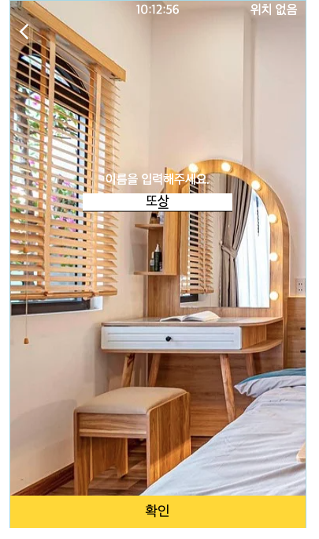
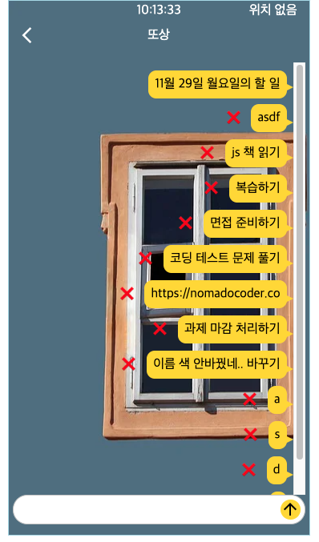

# todo_nomad

https://ddosang.github.io/todo_nomad/

## 1. 조건
1. 실시간 시계
2. 로컬 스토리지를 사용한 로그인
3. 로컬 스토리지를 사용한 투두리스트
4. 랜덤 배경 이미지
5. 날씨와 위치 (geolocation)
6. 여러분의 CSS 실력을 뽐내주세요💖

 

## 2. 내가 만든 것

아이폰과 카카오톡 '나에게 보내기' 디자인을 모티브로 만들었다.

 

    
    

- 위치 허용을 한 경우, 해당 지역과 날씨가 뜨도록 했다.
- 새로고침 할 때 마다 새로운 이미지가 깔린다.

 

    
    

- 이름은 처음 한번만 입력하고, 한번 입력 후에 다시 접속하는 경우에는 메인에서 바로 메모 목록으로 넘어가게 만들었다.
- 이름을 수정하고 싶은 경우에는 메모 목록에서 이전을 눌러서 이름 입력 창으로 돌아간 후 수정할 수 있다.
- 메모 목록은 입력과 삭제가 가능하다!